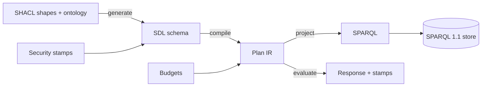

# CartoQL

**GraphQL over RDF, compiled with a plan-level security kernel.**

CartoQL turns any RDF graph — an ontology, a triple store, a SPARQL endpoint — into a
**versioned GraphQL API**, and compiles every GraphQL document down to SPARQL plans
that carry **access-control joins, cost budgets, and provenance** *inside the query
plan*, where they can't be bypassed by resolvers or client cleverness.



## Quick example

```bash
npm run serve -- --ontology my-onto.ttl --shapes my-shapes.ttl --data my-data.ttl
# → gateway at http://localhost:4137
# → console UI at http://localhost:4137 (same-origin)
```

```graphql
{
  people(first: 5, orderBy: NAME_DESC) {
    edges { node { iri name worksFor { iri name } } }
    pageInfo { hasNextPage endCursor }
  }
}
```

Response:
```json
{
  "data": {
    "people": {
      "edges": [
        { "node": { "iri": "…#person-sato", "name": "Emi Sato", "worksFor": null } },
        { "node": { "iri": "…#person-dov", "name": "Dov Lindqvist",
            "worksFor": { "iri": "…#org-north", "name": "Northwind Analytics" } } }
      ],
      "pageInfo": { "hasNextPage": true, "endCursor": "eyJ…" }
    }
  }
}
```

## What makes CartoQL different

|                               | Typical GraphQL-RDF tools           | CartoQL |
|-------------------------------|-------------------------------------|---------|
| **Schema generation**         | hand-mapped, rots                   | generated from ontology + SHACL (never mapped) |
| **Security**                  | filter resolvers, post-hoc          | compiled into the SPARQL plan itself (can't be bypassed) |
| **Controlled vocabulary**     | auto-generated (noise)              | your ontology names the fields (owl:inverseOf, rdfs:domain, rdfs:range) |
| **Pagination**                | limit/offset (leaks entities)      | cursor-based, canonical-windowed, ordering-validated |
| **Type model**                | one shape = one type                | full interface hierarchy, polymorphic fields, `__typename`, typed fragments |
| **Cost control**               | none                                | per-plan budgets with typed rejection (`CQL_QUERY_TOO_COMPLEX`) |
| **Provenance**                | text citations                      | every fact carries its IRI (identifier as data) — or removed when gate-denied |

## Read next

- [Quickstart](getting-started.md) — a full working example in 5 minutes
- [Usage Examples](examples.md) — copy-pasteable queries covering every engine feature
- [The Console](console.md) — the GraphiQL-class UI with schema graphs and autocomplete
- [Security Model](security.md) — how two-track security works (and what it guarantees)
- [Ontology as the Model](ontology.md) — what CartoQL reads from *your* ontology at boot time